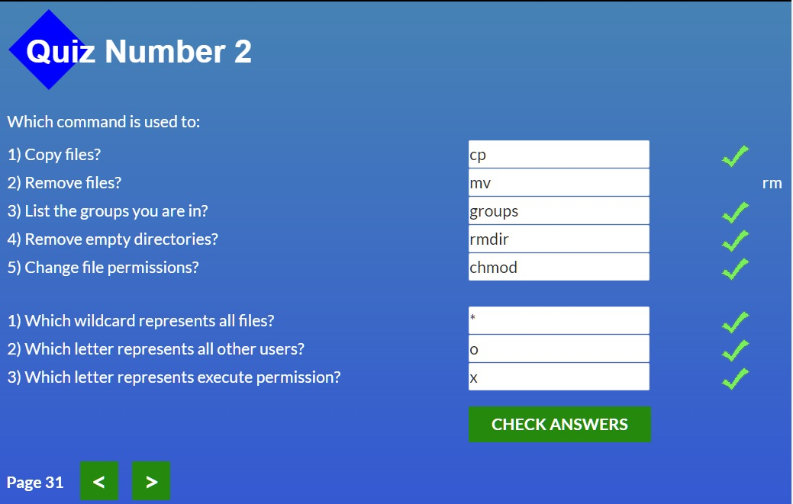
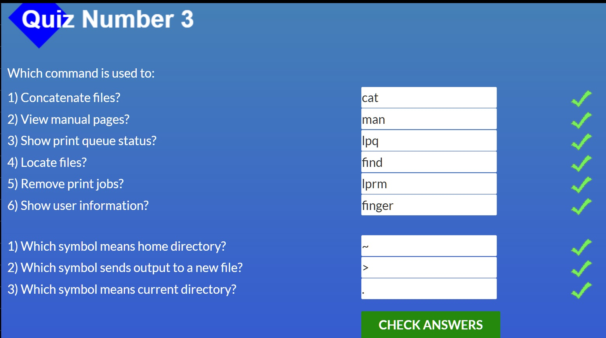
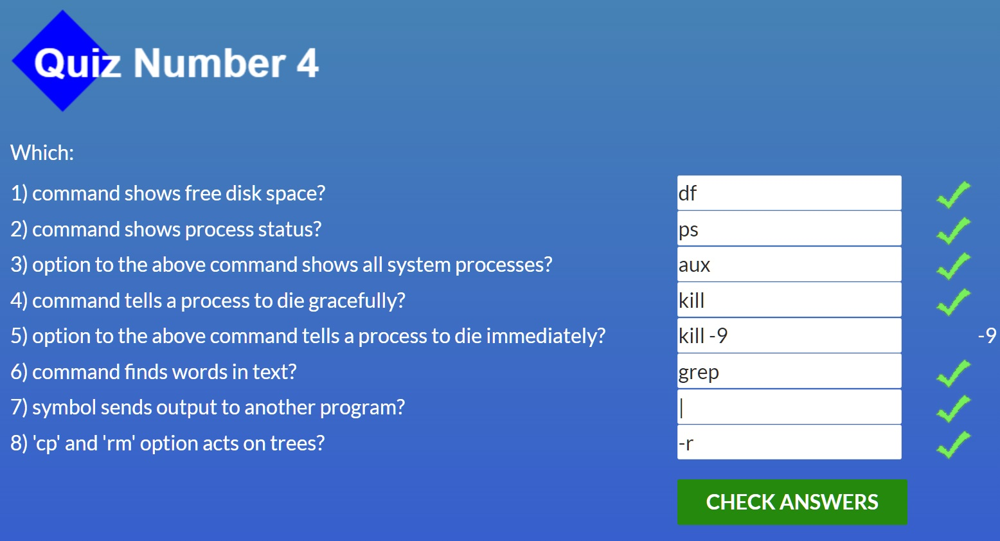
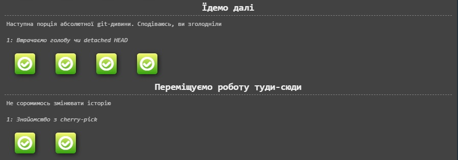
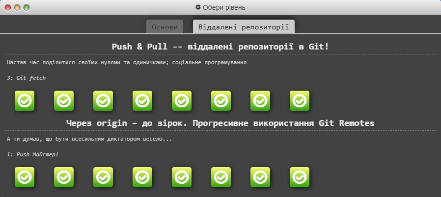
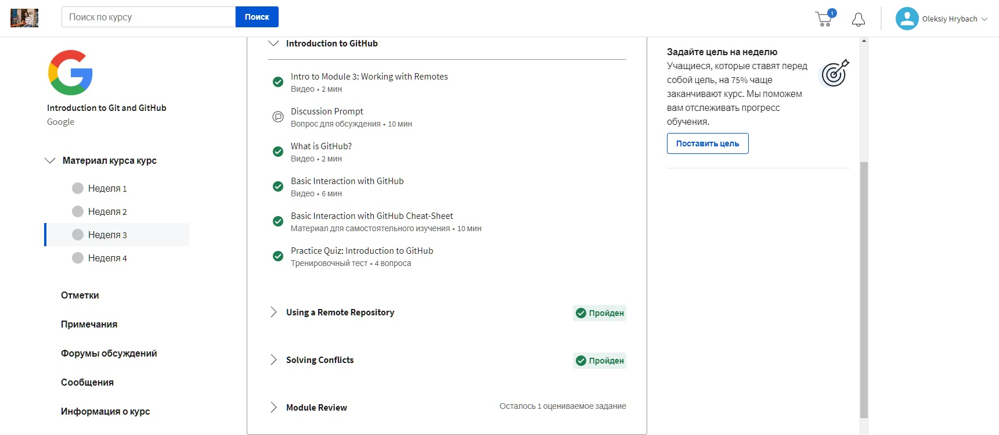
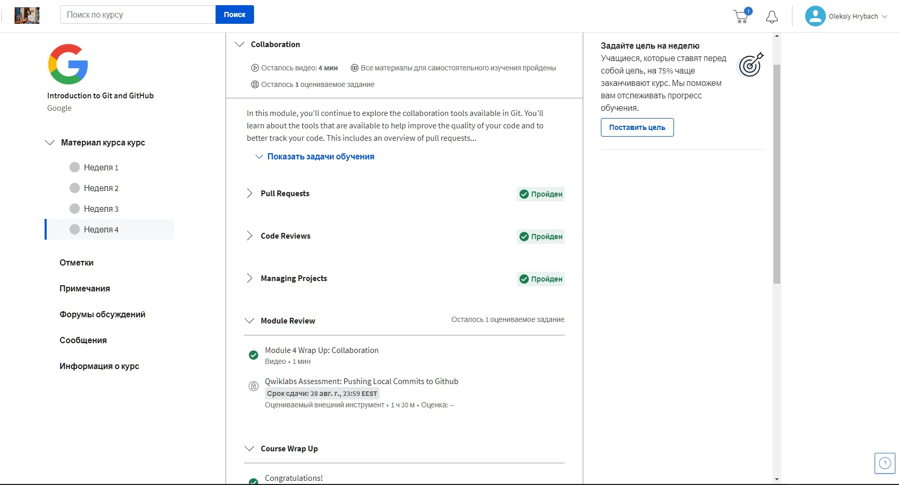
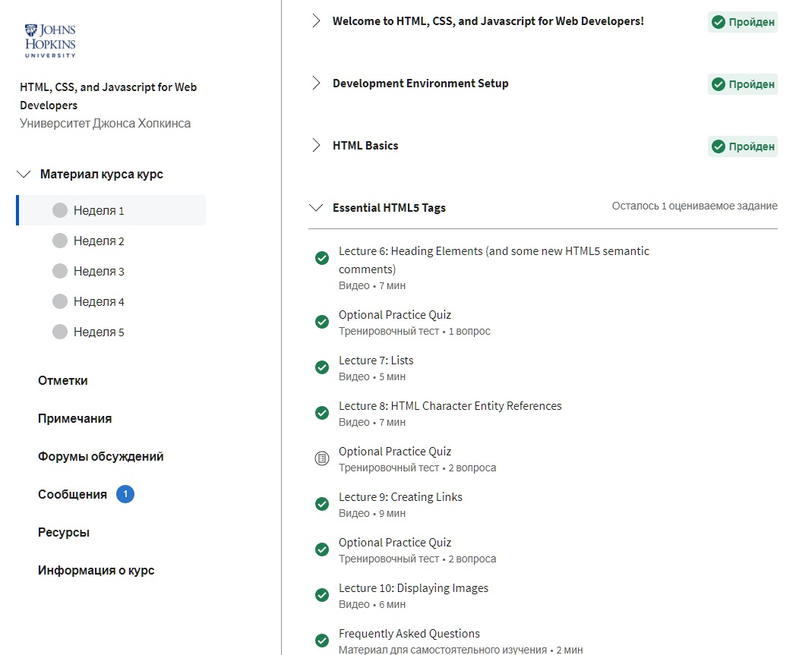
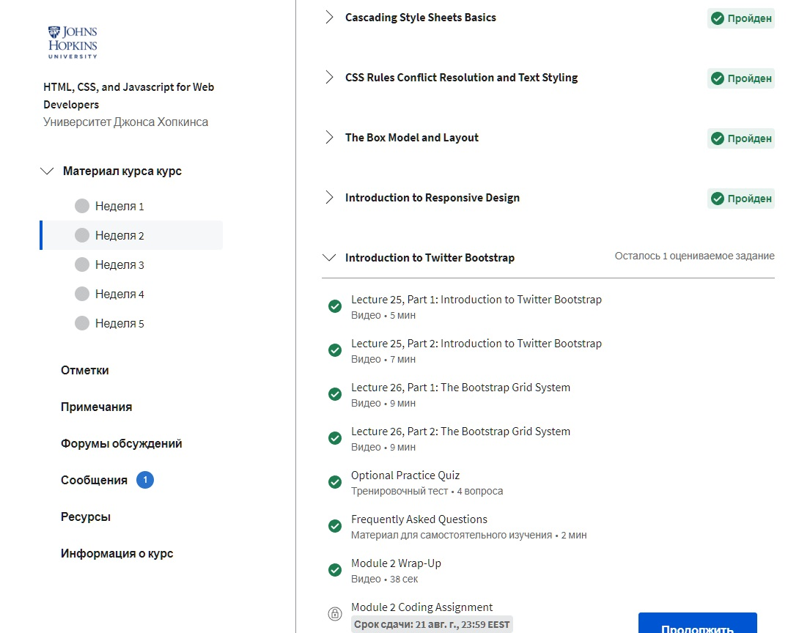
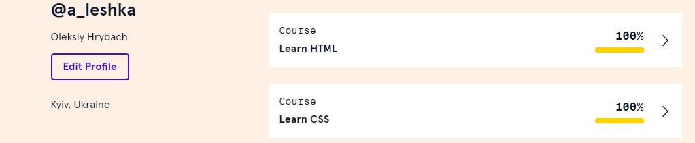

# kottans-frontend

 ## Stage 0. Self-Study

 General
 

- [x] 0.Git Basics
- [x] 1.Linux CLI and Networking
- [x] 2.Git Collaboration

 Front-End Basics
 

- [x] 3.Intro to HTML & CSS
- [ ] 4.Responsive Web Design
- [ ] 5.HTML & CSS Practice
- [ ] 6.JavaScript Basics
- [ ] 7.Document Object Model 

 Advanced Topics
 

- [ ] 8.Building a Tiny JS World (pre-OOP)
- [ ] 9.Object oriented JS 
- [ ] 10.OOP exercise 
- [ ] 11.Offline Web Applications 
- [ ] 12.Memory pair game 
- [ ] 13.Website Performance Optimization 
- [ ] 14.Friends App 

---
 ## General:
 ---
## 1.Linux CLI, and HTTP

Task Linux CLI
 

Before start learning this module I knew and even used some Linux commands but definitely [Linux Survival](https://linuxsurvival.com/linux-tutorial-introduction/) helped me improve my skills and I hope this tutorial will help me in the future.
As for HTTP part I guess it's not a suitable article for beginners. Too literal translate, too much parentheses, in a word too complicated IMHO. I think there are some another good material in the net.

## 2.Git Collaboration

Learn Git Branching
 

Introduction to Git and GitHub: week 3, week 4
 

Honestly, I used git and Github before, but as I now understand it was easiest flow with simpliest commands such git add, git commit and git push. Now I clearly see what I need to improve. I had trubles with understanding of rebase, changes commits and even difference between git fetch and git pull. So, I have a lot to do in this way. Most important thing I'v learned from this task-I need more practice!

## 3.Intro to HTML and CSS

Introduction to Responsive Design: week 1, week 2
 

Learn HTML&CSS
 

Already have some expirience with HTML and CSS, despite this I learned something new. For example, that not all html tags have dafault property of positioning as static)). 
After all, guess it was usefull to refresh my knowledge.