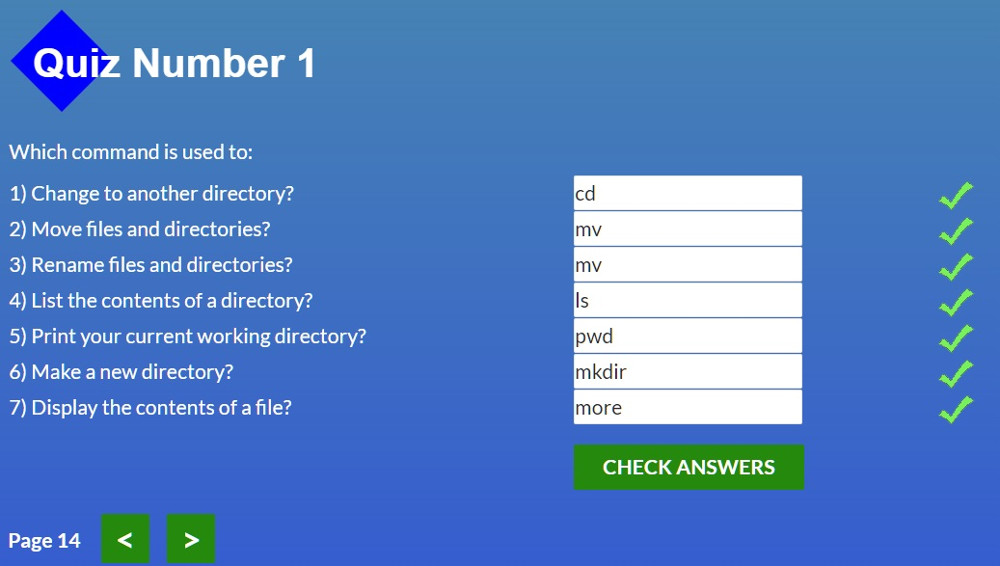

# kottans-frontend

 ## Stage 0. Self-Study

 General
 

- [x] 0.Git Basics
- [x] 1.Linux CLI and Networking
- [ ] 2.Git Collaboration

 Front-End Basics
 

- [ ] 3.Intro to HTML & CSS
- [ ] 4.Responsive Web Design
- [ ] 5.HTML & CSS Practice
- [ ] 6.JavaScript Basics
- [ ] 7.Document Object Model 

 Advanced Topics
 

- [ ] 8.Building a Tiny JS World (pre-OOP)
- [ ] 9.Object oriented JS 
- [ ] 10.OOP exercise 
- [ ] 11.Offline Web Applications 
- [ ] 12.Memory pair game 
- [ ] 13.Website Performance Optimization 
- [ ] 14.Friends App 

---
 ## General:
 ---
## 1.Linux CLI, and HTTP

Task Linux CLI
 

Before start learning this module I knew and even used some Linux commands but definitely [Linux Survival](https://linuxsurvival.com/linux-tutorial-introduction/) helped me improve my skills and I hope this tutorial will help me in the future.
As for HTTP part I guess it's not a suitable article for beginners. Too literal translate, too much parentheses, in a word too complicated IMHO. I think there are some another good material in the net.

